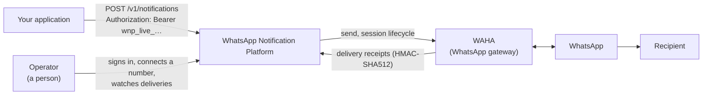
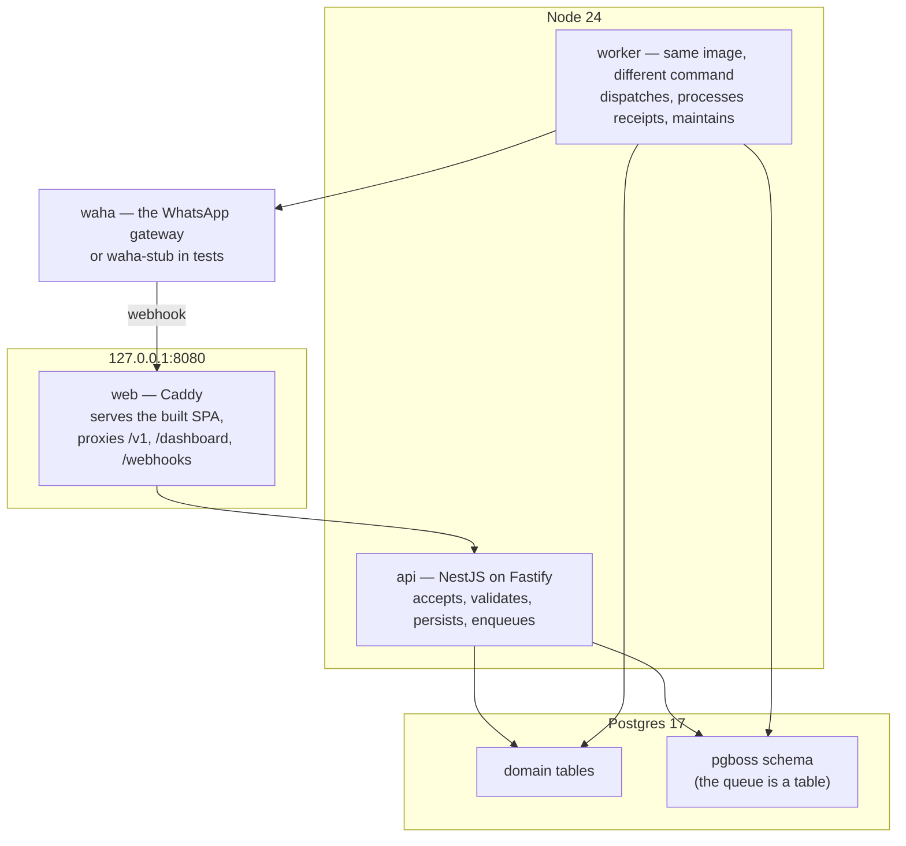
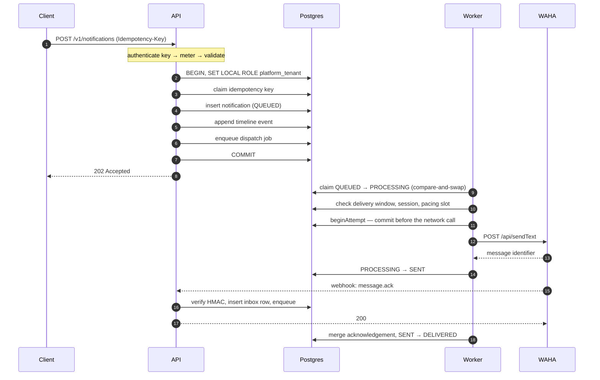
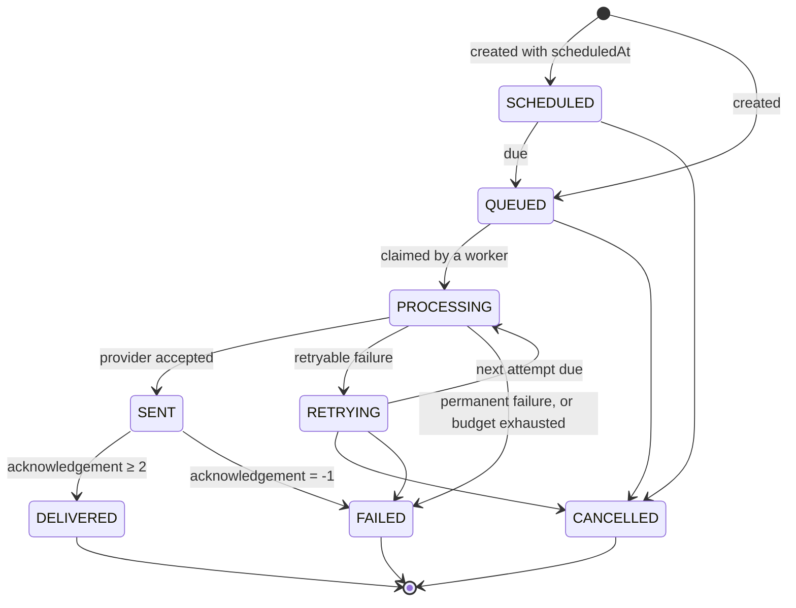

# Architecture

This document describes what the platform is made of, how a notification travels
through it, and which parts are load-bearing. Decisions and their alternatives
live in [the decision records](adr/README.md); this is the map, not the argument.

## The problem

An application wants to send a WhatsApp message and wants to know what happened
to it. Integrating with a WhatsApp gateway directly gives it a synchronous call
that can fail for a dozen different reasons, no retry policy, no record, and no
answer to "what happened to the message I sent on Tuesday".

The platform sits in between. It accepts a notification, answers immediately,
and takes responsibility for delivering it — retrying what should be retried,
refusing what cannot succeed, and keeping a timeline that answers the Tuesday
question.

## Context

WAHA is treated as infrastructure, not as a trusted application boundary. It
holds a paired WhatsApp account, its API has no per-tenant authorisation, and it
is never published to the network in the default setup.

## Containers

`migrate` is a fourth process and a one-shot: it applies migrations, provisions
the queues, grants the runtime roles what they need, and exits. The API and the
worker both wait for it to complete, which removes the startup race where
several processes try to migrate at once.

## Packages

| Package             | Depends on                    | Holds                                                                     |
| ------------------- | ----------------------------- | ------------------------------------------------------------------------- |
| `domain`            | Zod only                      | State machine, retry policy, phone normalisation, ports, failure taxonomy |
| `contracts`         | `domain`                      | Request and response schemas shared by the API and the dashboard          |
| `database`          | `domain`, Drizzle             | Schema, migrations, repositories, the tenant scope                        |
| `queue`             | `domain`, pg-boss             | Queue names, transactional enqueue, bootstrap                             |
| `provider-whatsapp` | `domain`, undici              | The WAHA adapter, failure classification, webhook verification            |
| `security`          | `domain`, node:crypto, argon2 | Password hashing, API keys, session tokens, encryption, system ports      |
| `configuration`     | Zod                           | The environment schema, and the refusal to boot without it                |
| `observability`     | pino                          | Logger, correlation context, the event vocabulary                         |
| `composition`       | all adapters, `@nestjs/*`     | Services and modules — the only thing the applications wire               |
| `testing`           | test tooling                  | Postgres harness, fixtures, shared test configuration                     |

The direction of every arrow is enforced three ways: by what each package
declares as a dependency, by a `dependency-cruiser` ruleset in continuous
integration, and by TypeScript project references. See
[ADR 0002](adr/0002-layered-packages-over-a-framework.md).

## The path of a notification

Everything between the request and the response is one transaction, and it
contains no network call. That is what makes the transactional enqueue sound —
see [ADR 0005](adr/0005-transactional-enqueue-over-outbox.md).

## States

`READ` is not a state. An acknowledgement of 3 or more sets `read_at` and leaves
the status alone, so `DELIVERED` stays terminal. There is no `PROCESSING →
CANCELLED`, because a provider call may already be in flight and a sent message
cannot be recalled; cancelling one answers 409. There is no `FAILED → QUEUED`,
because a retry creates a new notification that points at the original.

## What makes it safe

**Claim before send.** A compare-and-swap moves the notification to
`PROCESSING`. Zero rows means another worker owns it, and the handler completes
successfully rather than throwing. Concurrent double sends are impossible; the
crash window is narrowed but, honestly, not closed. See
[ADR 0007](adr/0007-at-least-once-delivery.md).

**The attempt budget is spent before the network call.** `beginAttempt`
increments the count and writes an attempt row with no outcome, and commits. An
infrastructure redelivery therefore still burns an attempt, and the queue's own
retry limit cannot silently exceed the business budget.

**Tenant isolation, three deep.** Repositories scope by `application_id`;
composite foreign keys make a cross-tenant reference impossible to write; and
row level security makes a forgotten predicate return nothing. See
[ADR 0014](adr/0014-row-level-security-as-a-backstop.md).

**Correlation.** Every job payload carries a `correlationId`, so the chain
`correlationId → notificationId → providerMessageId → webhookEventId` is
traversable from any one of the four. Logs are structured, with a stable dotted
`event` field on every line, and message content and phone numbers are redacted:
that is customer data, and it belongs in the tenant-scoped dashboard rather than
in a log aggregator.

## Health, and what each probe means

`/health` is liveness and checks nothing. A liveness probe that touches the
database turns a thirty-second blip into a restart storm.

`/ready` reports whether this instance can do useful work: it checks the
database and the queue, and returns 503 with a reason when they are unreachable.
WAHA is reported as informational and never affects the status code — a WhatsApp
outage must not take the dashboard offline exactly when an operator needs to see
the queue.

## Where the seams are

- **A second provider.** Implement `WhatsAppProviderPort` and register it. The
  notification rules do not change, because they never mention WAHA.
- **Tracing.** There is none. The three hops are stitched by `correlationId`
  through structured logs, which answers "what happened to this notification"
  but not "where did the time go". Adding OpenTelemetry means instrumenting the
  API, the worker and the provider adapter; nothing in the design is in its way.
- **A different rate limit store.** The limiter is behind a repository. Moving it
  to Redis is a class, not a redesign — see
  [ADR 0012](adr/0012-gcra-rate-limiting-in-postgres.md).
